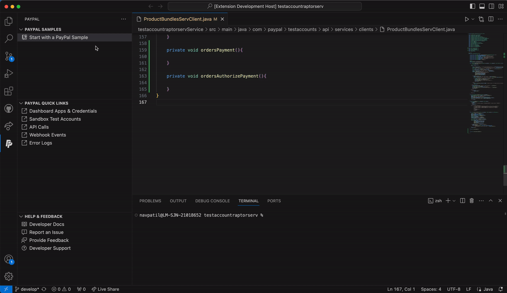
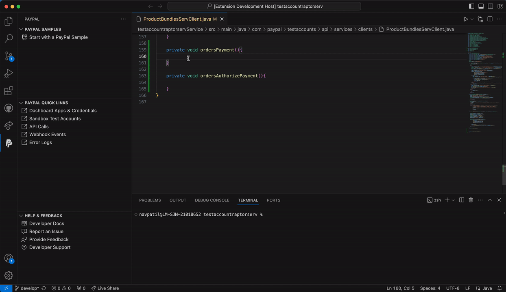

# PayPal

<h1 align="center">
   
    
   

</h1>

<h3 align="center"> Build, test, and use PayPal inside your Visual Studio code editor</h3>
The PayPal extension for Visual Studio Code simplifies tasks such as generating code snippets and integrating PayPal features directly into your coding workspace.   

Within this extension, you can find a specialized PayPal panel located in the activity bar. This panel provides you with quick access to a curated collection of code samples, code snippets customized for various programming languages, and quick links to  developer resources.   

It also enhances your development workflow by expanding the command palette with frequently used developer operations.

## Features

* **PayPal samples:** Get started quickly with a PayPal code sample. Code samples include all the client and server code you need for various integration scenarios. The extension supports cloning and opening the sample in a new workspace. 

  

* **PayPal code snippets:** Quickly generate code snippets for common scenarios or API requests. After the snippet is generated, you can tab through it to input specific values.  

  
 
* **PayPal quick links**: Quickly access the PayPal Developer Dashboard to manage resources such as API keys and webhooks.  

  

---
## Telemetry
The PayPal VS Code Extension collects telemetry data to help us improve the extension. You can opt out of telemetry collection at any time by disabling telemetry in [VS Code settings](https://code.visualstudio.com/docs/getstarted/telemetry) . If telemetry is disabled, we will not collect any data. 

---
## Submit Issues & Feedback
You can create a bug or feature request for the PayPal Visual Studio Code extension:

* Select the **Help & Feedback** panel in the activity bar. The extension will open a new screen that directs you to GitHub in your browser.
* In your browser, select **Get started** to create a bug or feature request.
* Enter the bug or feature request details, then select **Submit new issue**.

---

## License

The extension is licensed under Apache License 2.0 . 
See [LICENSE](LICENSE.md)

---
## For more information

[PayPal Developer Documentation](https://developer.paypal.com/)
